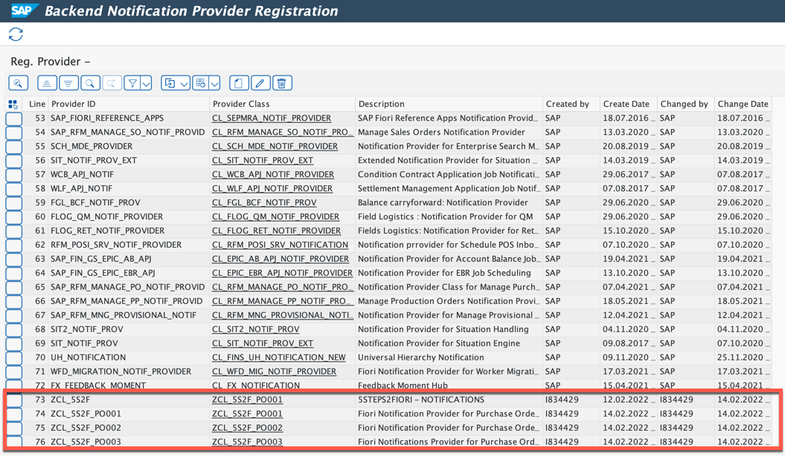
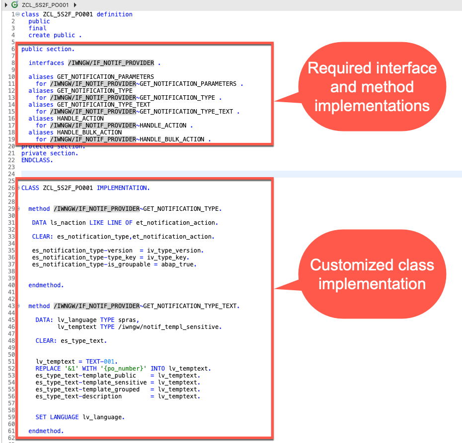

# UNDERSTANDING SAP FIORI NOTIFICATION FRAMEWORK

## Introduction
In this section you will find the required steps to test and develop a Notification Provider for SAP Fiori. To start with this topic we will first provide a high-level description of the framework and how it works.

## Notification Framework – Overview
The Notification framework is an embedded engine included in your SAP S/4HANA instances starting with SAP S/4HANA 1610 and ABAP stack 7.52. This framework is completely ABAP based and consists of 3 elements:

-	Notification Metadata
-	Notification Framework
-	Notification Provider

## Notification Metadata
Refers to the payload needed to create and display the notification. The notification objects is a standarized structure containing 4 main elements:
-	Notification type/description – Describes the notification provider object that will be used to render the notification in the SAP Fiori Launchpad
-	Notification Properties – Describes the parameters that will be passed to the underlying ABAP classes of the notification provider to display dynamic values in the notification text.
-	Notification Recipients – Describes the technical User ID’s of the people who will receive the notification. One notification can have multiple recipients.
-	Notification Target Parameters – Describes the semantic object, action and navigation parameters of the application that will be displayed when a user clicks on the notification.

If you want to become familiar with the notifications data structure, you can take a look at the following JSON structure where you can identify the main elements of the notification payload

  

## Notification Framework
The notification framework is a set of standarized ABAP classes and services which control the creation, deployment and maintenance of notifications in the SAP ABAP stack. Amongst the most important features provided by the framework we can list the following:

### Transactions:
-	/IWNGW/BEP_NPREG – To register a custom or standard notification provider.
-	/IWNGW/VB_REG_P – To activate notification providers.
-	/IWNGW/H_CLEAR_CACHE – To clear the notification metadata in the server
-	/IWNGW/H_CLEAR_NOTIF – To clear received notifications for a specific user

  

### Services:
-	/IWNGW/NOTIFICATION_SRV – Odata V4 service responsible for the extraction of notification payload in the SAP Fiori Launchpad
-	/IWNGW/CREATE_NOTIFICATION_SRV – Standard OData V2 service that offers the capability of creating notifications through HTTP Post operations.

  

## Notification Provider
A notification provider is a standard or custom ABAP class in your SAP S/4HANA system based on standard interface: /IWNGW/IF_NOTIF_PROVIDER.

Development of a custom notification provider implies leveraging a standard inerface meaning a set of standard methods must be implemented on your own for the notifications to work correctly. A brief description of each of these methods is provided:

-	/IWNGW/IF_NOTIF_PROVIDER~GET_NOTIFICATION_PARAMETERS: Returns notification instance specific parameters (defined in the payload). These parameters are combined with text templates (text message) to form the text of a notification.
-	/IWNGW/IF_NOTIF_PROVIDER~GET_NOTIFICATION_TYPE: Returns metadata related to the notification type like Provider ID, available notification parameters and actions.
-	/IWNGW/IF_NOTIF_PROVIDER~GET_NOTIFICATION_TYPE_TEXT: Returns language dependent text related to the notification type, including text templates and action texts.
-	/IWNGW/IF_NOTIF_PROVIDER~HANDLE_ACTION: Required when notification allows end users to trigger actions (defined in GET_NOTIFICATION_TYPE).

   

For more information on Notification Providers click on this link
