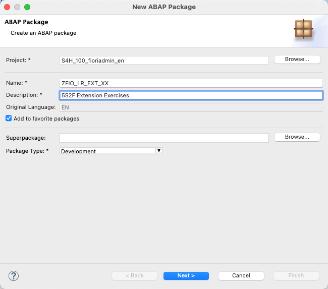
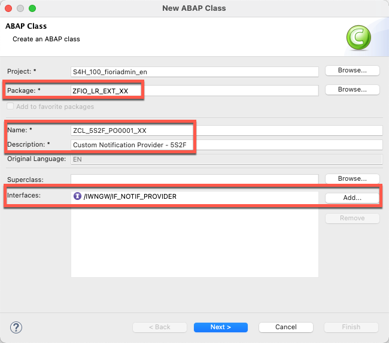
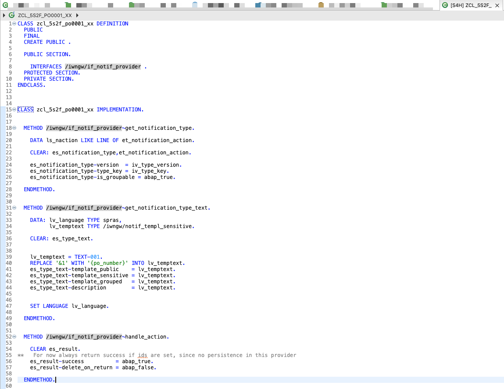
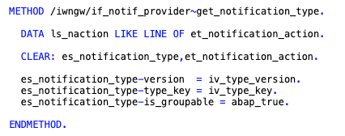
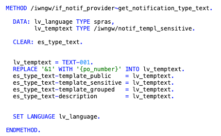
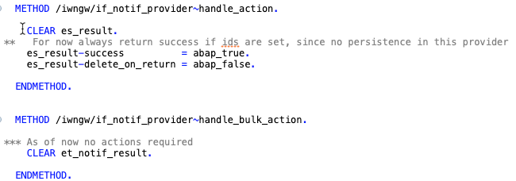
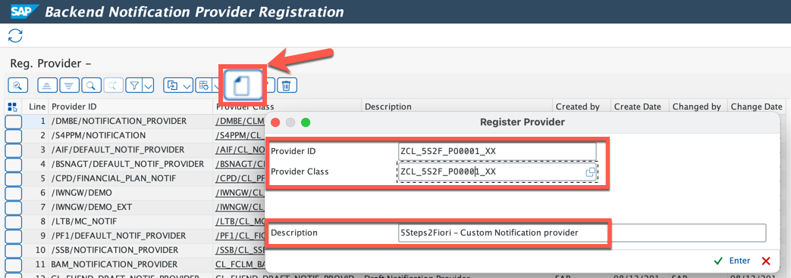
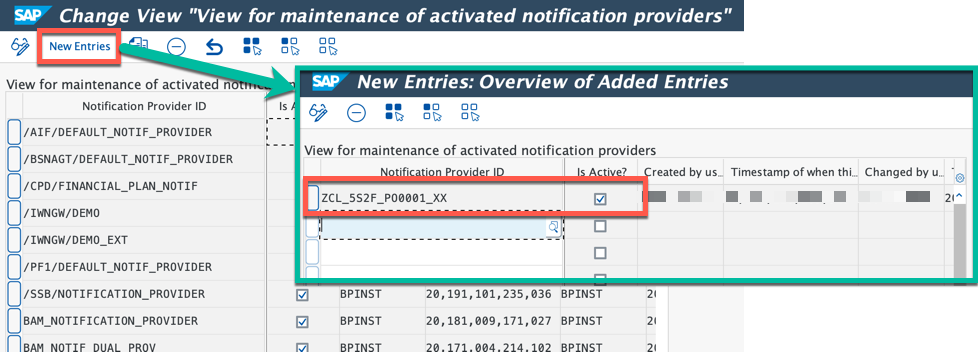
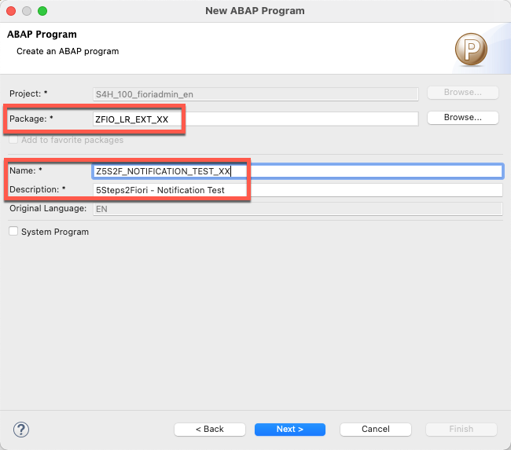
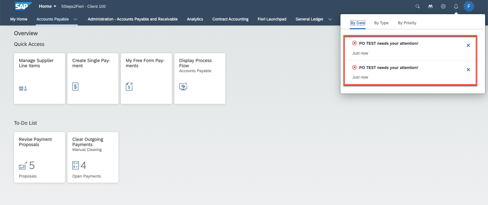

# DEVELOPING AND TESTING A CUSTOM NOTIFICATION PROVIDER

## Introduction
You will now start the development of a custom notification provider so you can later integrate this with your custom Fiori app.

Note – For this exercise we will assume you have concluded previous work packages in the developer workstream, hence you are familiar with the use of ABAP Developer Tools. For this reason instructions on how to create packages, classes, etc. will not be provided in detail.

## Create a Custom Package
Logon to your S/4HANA system with your developer user and create a custom package where XX represents your developer ID.

- Name: ZFIO_LR_EXT_XX
- Description: 5S2F Extension Exercises
- Type: Development
- Software Component: HOME
- Transport Request: <choose your own>

  

## Create a Custom Class
Create a custom class in your recently created package, consider the following details where XX represents your developer ID:

- Package: ZFIO_LR_EXT_XX
- Description: ZCL_5S2F_PO0001_XX
- Interfaces: /iwngw/if_notif_provider

  

## Add code to Custom Class
Copy code from source folder. This implementation includes code for methods:

- /iwngw/if_notif_provider~get_notification_type
- /iwngw/if_notif_provider~get_notification_type_text.
- /iwngw/if_notif_provider~handle_action.
- /iwngw/if_notif_provider~handle_bulk_action.

Note – We will first have you create all objects and afterward explain the code considering the simplest implementation for a notification provider.
  
  

## Add Text Elements
Add text elements:

Syntax:
\\@MaxLength:80
001=PO &1 needs your attention!

Note – We will first have you create all objects and afterward explain the code considering the simplest implementation for a notification provider.
  

### Save and Activate your code!!

# EXPLAINING THE CODE

## Method: /iwngw/if_notif_provider~get_notification_type
You will be using the simplest declaration of the notification metadata, so as long as your notification provider exists the notification framework will attempt to display information obtained in the GET_NOTIFICATIONTYPE_TEXT method.

  

## Method: /iwngw/if_notif_provider~get_notification_type_text
In this method you will retieve a predefined message from the text elements in your class and replace the &1 value with the value of parameter “PO_Number”. The value of parameter “PO_Number” will be provided when sending the notification payload to the notification framework.

  

## Method: /iwngw/if_notif_provider~handle_action
## Method: /iwngw/if_notif_provider~handle_bulk_action
For this exercise we will only focus on sending a notification only showing text so the options to perform actions (approve, reject, mass approve, mass reject) are not required. Still the definition of these classes is needed for the notification to work properly.

  

## Method: /iwngw/if_notif_provider~get_notification_parameters
You should have noticed we are missing a definition of method /IWNGW/IF_NOTIF_PROVIDER~GET_NOTIFICATION_PARAMETERS. This method is not needed in our implementation as we will not hardcode any of the parameter values.

  

# REGISTERING AND ACTIVATING THE NOTIFICATION PROVIDER

## Register your custom provider
To register your notification provider class run transaction /n/IWNGW/BEP_NPREG and register your class by creating a new entry and providing the following information where XX represents your developer ID:

- Provider Id: ZCL_5S2F_PO0001_XX
- Provider Class: ZCL_5S2F_PO0001_XX
- Description: 5Steps2Fiori – Custom Notification Provider

You will be prompted for a package and transport request:
- Package: ZFIO_LR_EXT_XX
- Transport Request: <choose your own>

  

## Activate your custom provider
Once the provider is registered, you need to activate this provider by running transaction /n/IWNGW/VB_REG_P and activating your provider by creating a new entry and providing the following information where XX represents your developer ID:

- Notification Provider Id: ZCL_5S2F_PO0001_XX
- Is Active? Checked

You will be prompted for a transport request:
- Transport Request: <choose your own>

  

# TESTING YOUR CUSTOM PROVIDER

## Create a custom test program
In your custom package create a new ABAP program with the following information where XX represents your developer ID:

- Package: ZFIO_LR_EXT_XX
- Name: Z5S2F_NOTIFICATION_TEST_XX
- Description: 5Steps2Fiori – Notification Test

You will be prompted for a transport request:
- Transport Request: <choose your own>

  

Copy and activate the code. Make sure you set edit values to match your system ID and your username.

  

Run your program and login to your Fiori Launchpad and you should see two notifications which were generated by your test program. This confirms that the notification provider works correctly.

  

# CONCLUSION
You have created and tested your custom notification provider. In the next section you will find an option to trigger notification creation from an OData service.
