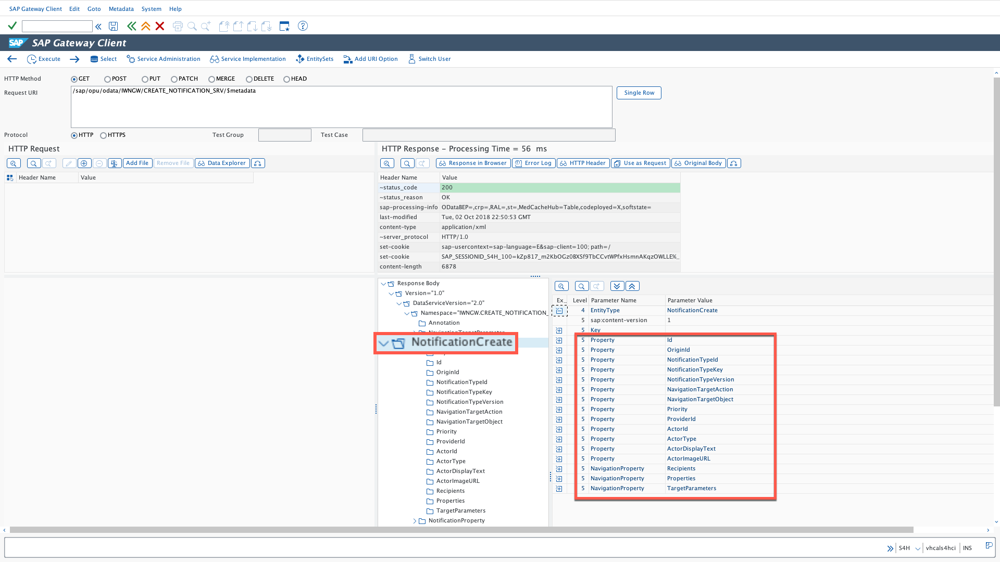
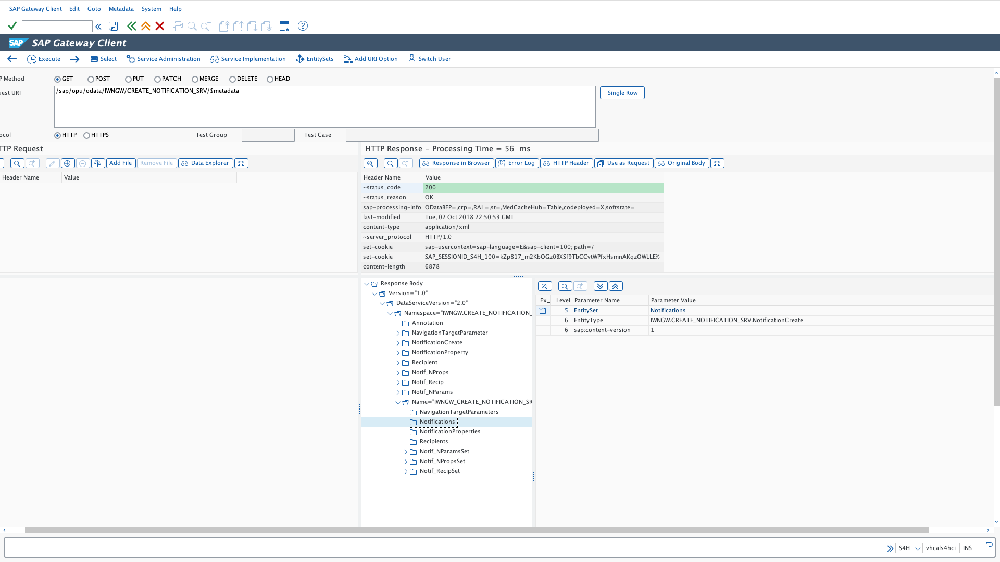
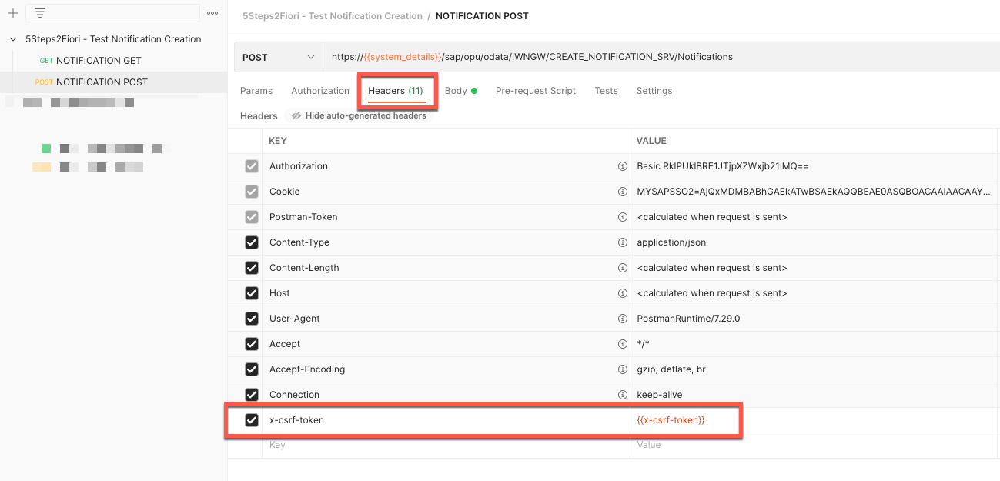
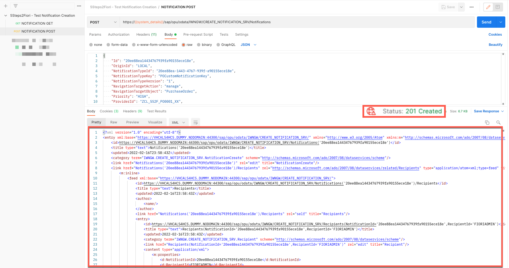
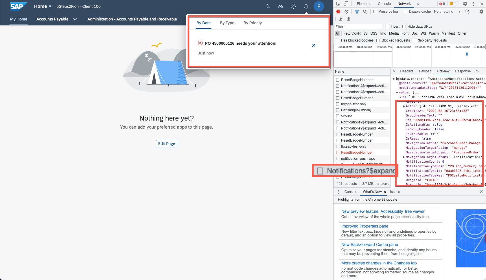

# TRIGGERING NOTIFICATIONS FROM AN ODATA SERVICE

## Introduction
In this section you will explore an option that will allow you to call an OData service to trigger notification creation.  You will later use this approach for the custom SAPUI5 code you will add in the SAP Fiori app extension.

Note – If you are familiar with Postman you will find a collection you can import into your workspace and test Odata calls to service /IWNGW/CREATE_NOTIFICATION_SRV using Postman. You will find this information in  or in our publicly available .

## Activate service /IWNGW/CREATE_NOTIFICATION_SRV
Logon to your SAP S/4HANA backend and activate service /IWNGW/CREATE_NOTIFICATION_SRV. You can do this using transaction /n/IWFND/MAINT_SERVICE.

Note – Make sure you activate this service in Co-Deployed mode

  

## Explore service /IWNGW/CREATE_NOTIFICATION_SRV
Use Gateway Client (/IWFND/GW_CLIENT) to explore service /IWNGW/CREATE_NOTIFICATION_SRV. It is recommended to run the $metadata call and explore the content with the Data Explorer option in Gateway Client

  

While exploring the metadata you should find the EntityType and EntitySet you would need to address if you want to execute a CREATE operation

  

To successfully test the create operation you would need to rely on additional tools like POSTMAN, which can help you automate the execution of POST requests and ensure request headers (in particular x-csrf-token) are set correctly in the request. We will briefly explain the process of running a POST request.

1. When running the POST request to EntitySet: Notifications, the value from header x-csrf-token will be validated by the system. If validation is successful the request will be executed, otherwise this means the user has no authorizations to execute a Create operation.

  

2.	Included in the body of the POST operation you will find the payload of the notification. Mandatory parameters are:

- Id --> GUID
- OriginId --> Always LOCAL for embedded deployments
- NotificationTypeId --> GUID
- NotificationTypeKey --> For our exercise this value can be anything as we are not validating Notification Type value in our notification provider class
- NotificationTypeVersion
- Priority --> HIGH / MEDIUM / LOW
- ProviderId --> Name of our custom notification provider class
- ActorId --> Sender ID
- Properties (Object)
- Recipients (Object)

  

3. When the request is executed successfully, HTTP code 201 is displayed and you would find the XML structure of the generated object.

  

4. Once you confirm the notification is created you can switch to the SAP Fiori Launchpad of the Notification Recipient and identify a new notification has arrived. You can use the browser's developer tools to explore the information retrieved by the Notifications OData service and confirm the values of the notification you created are correct.

  

# CONCLUSION
You have created and tested your custom notification provider. In the next section you will find an option to trigger notification creation from an OData service.
