# ADAPTATION – EXTENDING LIST REPORT USING ADAPTATION PROJECT

## Introduction
In this section you will start putting all pieces together: your custom notification provider, the OData service call, and your custom UI code extension in order to deliver innovations to your business. For this and upcoming sections it is important you have solved any connectivity issues between your On-Premise system, SAP Cloud Connector and your trial SAP BTP instance as Business Application Studio (BAS) will require connectivity between these elements to work properly.

Notes:
- **In this section we will assume connectivity issues have been solved and you are familiar with the destinations you created in WP01_D.**
- **For extending the UI you will be using Adaptation Projects in BAS. This feature is not yet available in Visual Studio Code.**

## Prepare Adaptation Project in Business Application Studio
Launch BAS, make sure your DevSpace is running and launch it. Once loaded, go to View --> Find Command, enter the keyword “template” and select option: Open Template Wizard.

  

Select Adaptation Project Generator

  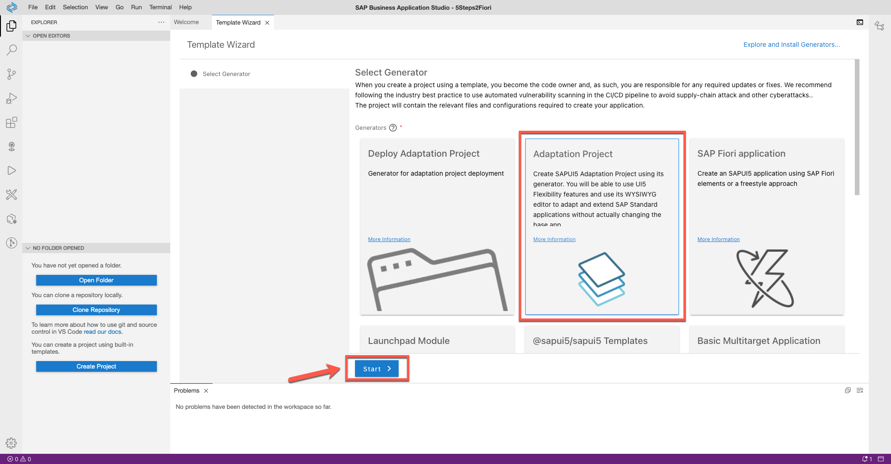

Select target environment: ABAP

  

Enter the details of your adaptation project where XX represents your developer ID and continue:

- Project Name: ZPOEXT.NOTIF.XX
- Application Title: Send Notifications
- Namespace: <Updated automatically>

Note:
* **DO NOT overwrite, delete, or edit the namespace value. The wizard relies on this value, changing it might affect the deployment of your project into your SAP S/4HANA system.**
* **Project name must be entered using UI component notation with letters/words and dots “.” only.**

  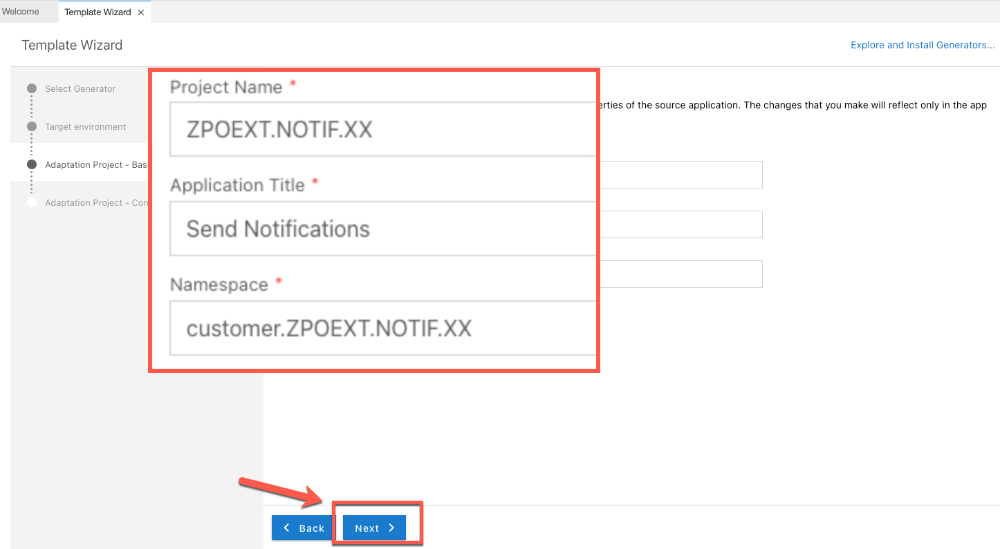

Define backend destination and login to retrieve available services.On successful authentication you will see the list of available apps.

Type application name “Manage Purchase Orders” and select it from the dropdown menu.

  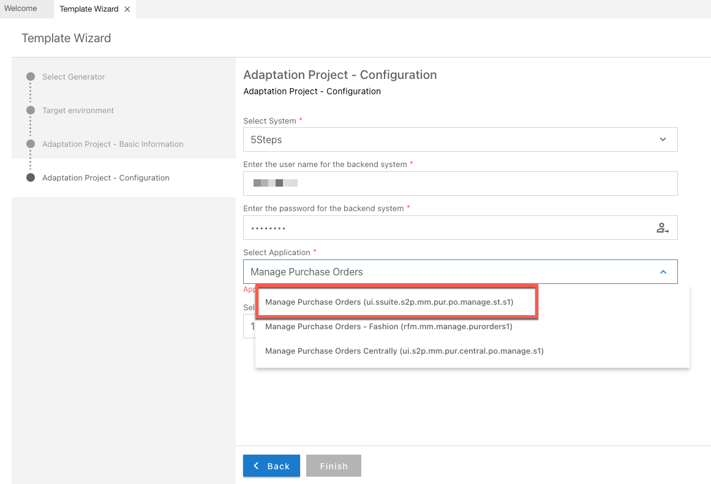

Use default values for field “Select SAP UI5 version” and click on Finish.

## Understanding Project Structure in Business Application Studio Adaptation Project
Once your workspace is reloaded you will notice a new project structure including multiple folders and files. For this exercise we will only work with the content inside the **webapp** folder.

* DO NOT MODIFY content from any other folder apart from the **webapp** folder.

  

### I18N folder
In here you will find all the values for text translations that you may add to your app. The concept is based on the JAVA internationalization standard where you define bundles (files) for each language (locale) that you wish to support.

Naming syntax of these files is the following:
- baseName + "_" + language1 + "_" + country1 + "_" + variant1
- baseName + "_" + language1 + "_" + country1
- baseName + "_" + language1
- baseName + "_" + language2 + "_" + country2 + "_" + variant2
- baseName + "_" + language2 + "_" + country2
- baseName + "_" + language2

Where baseName = i18n and the extension of these files must always be “.properties”.

**Note - We will not cover text localization in this exercise. For more information on this topic please refer to the [available documentation](https://sapui5.hana.ondemand.com/sdk/#/topic/91f217c46f4d1014b6dd926db0e91070).**

  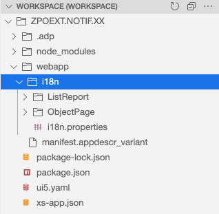

### Manifest.appdescr_variant file
This file references the original application manifest file which is the file that describes available objects in the original app. This means that any change you perform in this file will be injected into the original app.

In the following steps you will start modifying the app by using the Visual Editor which will in turn add required changes into the file automatically for you.

**Please note that you do not need to write any text entries into this file, the wizard will create the required changes in this file automatically so please refrain from manually editing this file.**

  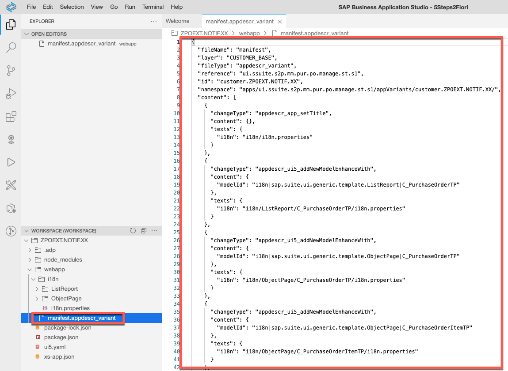

## Performing UI Adaptations with Visual Editor in Business Application Studio Adaptation Project
In this section you will start creating UI Adaptations with help of Visual Editor in Business Application Studio.

Right-click on file manifest.appdescr_variant and select Open SAPUI5 Visual Editor.

  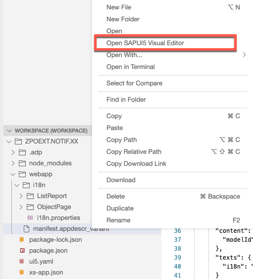

On first launch you will be prompted for authentication (twice). Enter your S/4HANA backend credentials and wait for the tool to finish loading.

  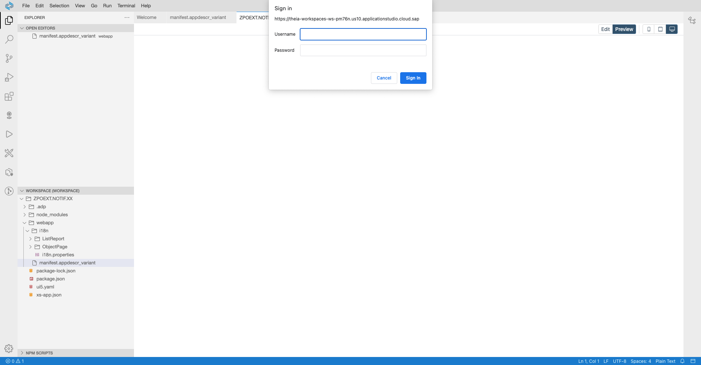

Visual Editor will load in Preview mode by default, which in turn allows you to interact with the app as you would normally do when using your On-Premise SAP Fiori Launchpad. Click on Go to retrieve information from the backend system.

  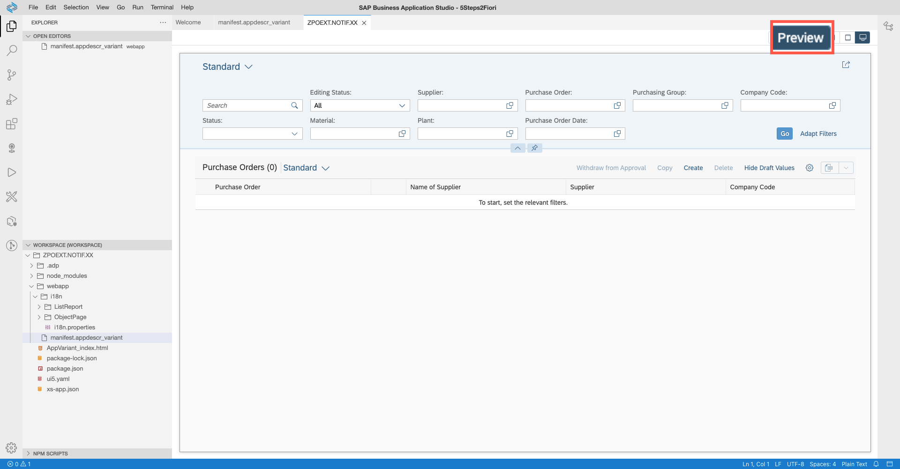

Once information is loaded, switch Visual Editor to Edit mode. You will notice additional sections are loaded.

In the Outline and Changes section you will find a list of all the available SAPUI5 controls in the app and the list of modifications that you create.

In the Control section you will find the technical details of the controls you select. Information in this section includes bound objects, control ID/name, etc.

  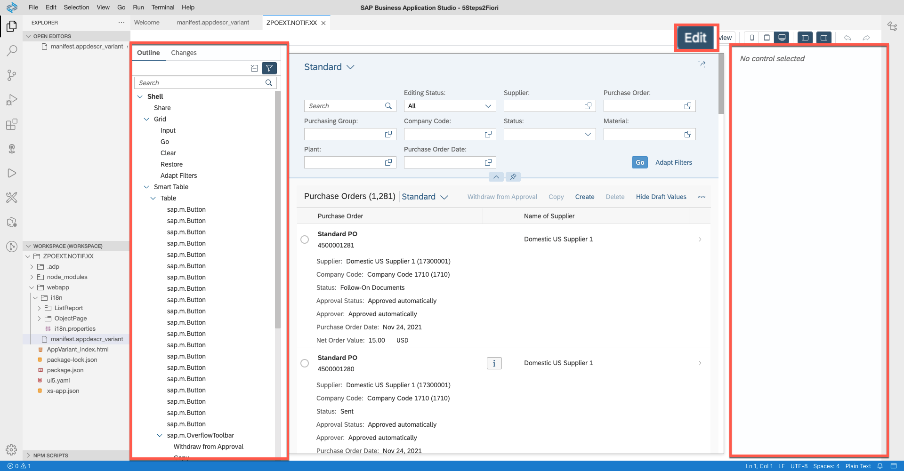

Right-click on any section of the filter grid and select Adapt Filters.

  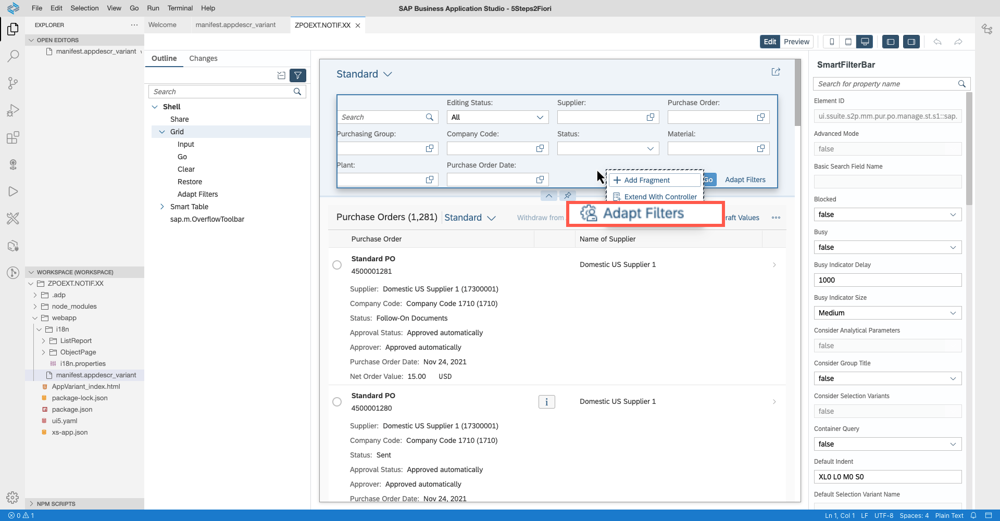

Adapt Filter screen will be displayed. Add/remove corresponding filters to make only the following filter options available:

- Company Code
- Status
- Purchase Order Date

Once ready, click on button Show Values

  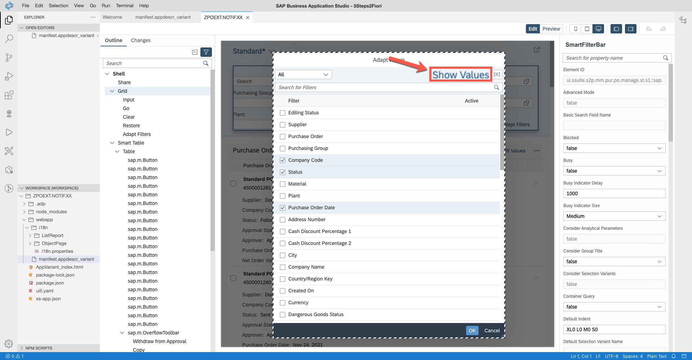

Set default values for the filters and click Ok.

- Status:     Not Yet Sent, Sent
- Purchase Order Date:     Last Year*

***Default value for Purchase Order Date filter is set for Last Year considering the use of CAL systems. If you are using your own On-Premise instance and know of a more suitable filter value, adjust this value as needed.***

  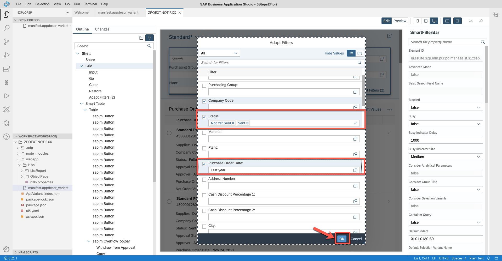

Right click on the Filter Variant menu and select option Save View As

  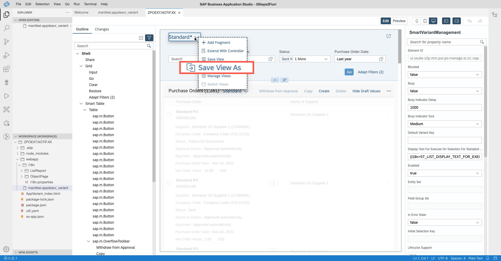

Name your view, set default load behavior and Save:

- View:     Send Notifications
- Set as default:     Checked
- Apply Automatically:     Checked

  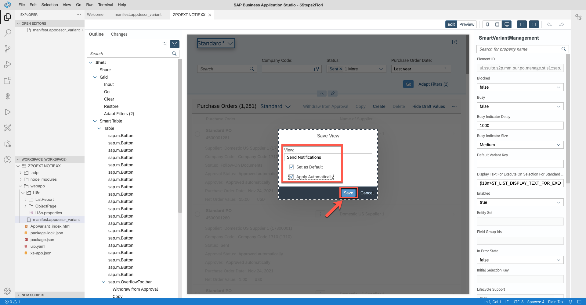

Remove not-required buttons from the layout: right-click on the action buttons in the table header and select option Remove.

Make sure the following buttons are removed:

- Withdraw from Approval
- Copy
- Create
- Delete
- Hide Draft Values

  

You will now create a table variant. To do so, switch to Preview mode and go to settings options of the table.

  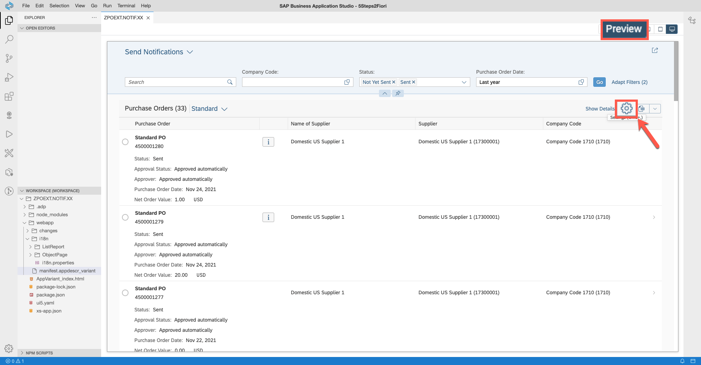

Activate field **Created By** and switch to Group settings.

  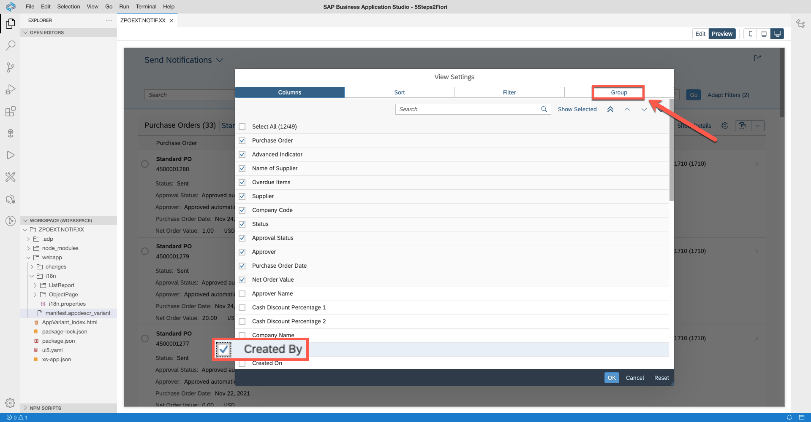

Set grouping for field Created By and click Ok.

  

Switch back to Edit mode and right-click on the table variant menu to select option Save View As.

Name your view, set default load behavior and Save:

- View:     Send Notifications
- Set as default:     Checked

  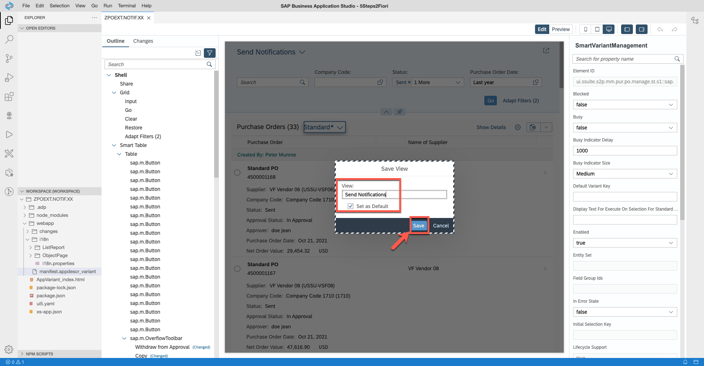

Switch to the Changes view and you will find a list of all the modifications we’ve performed so far. You will also find a new folder called changes listing all the code modifications done to the UI.

  

All the changes we have made so far are considered UI Adaptations, meaning they are runtime modifications; hence they will be controlled by an element called Layered Repository (LREP)

The Layered Repository has the capability of identifying runtime modifications based on instructions provided by an internal rendering API. The code you find in the files under the change folder is the metadata structure the internal API sends to the Layered Repository which allows for the modifications to become enabled during application load.

Per the name, LREP has multiple layers and for any of your extensions, changes should always be in the “CUSTOMER_BASE” layer.

  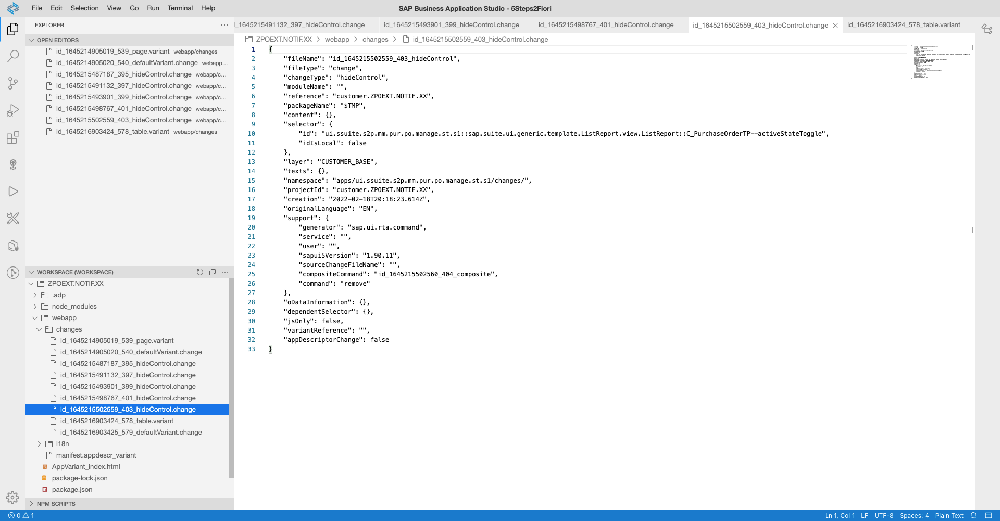

You can find more information about Layered Repository in the following link: [SAPUI5 Flexibility Services](https://help.sap.com/viewer/b4b7cba328bc480d9b373c7da9335537/2.08/en-US/a8e55aa2f8bc4127923b20685a6d1621.html)

# CONCLUSION
You have now concluded visual adaptation tasks for your extension project. In the next section we will run activities to add custom JAVASCRIPT code to your app and trigger notification creation
